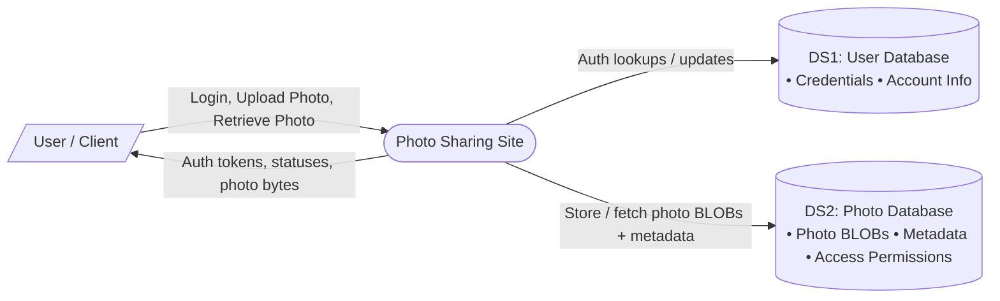
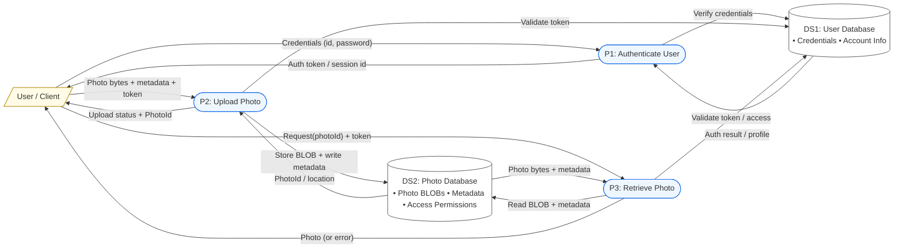

# Photo Sharing Site Diagrams

## High-Level Overview

```mermaid
flowchart LR
  %% External Entity
  U[/"User / Client"/]

  %% System as single process
  P0([Photo Sharing Site])

  %% Data Stores
  DS1[(DS1: User Database<br/>• Credentials • Account Info)]
  DS2[(DS2: Photo Database<br/>• Photo BLOBs • Metadata • Access Permissions)]

  %% Flows
  U -->|"Login, Upload Photo, Retrieve Photo"| P0
  P0 -->|"Auth lookups / updates"| DS1
  P0 -->|"Store / fetch photo BLOBs + metadata"| DS2
  P0 -->|"Auth tokens, statuses, photo bytes"| U
```

## Detailed Flow

```mermaid
flowchart LR
  classDef store fill:#fff,stroke:#444,stroke-width:1px;
  classDef proc fill:#eef7ff,stroke:#1f6feb,stroke-width:1.2px,rx:8,ry:8;
  classDef ext fill:#fffbe6,stroke:#b38600,stroke-width:1.2px,rx:6,ry:6;

  %% External
  U[/"User / Client"/]:::ext

  %% Processes
  P1([P1: Authenticate User]):::proc
  P2([P2: Upload Photo]):::proc
  P3([P3: Retrieve Photo]):::proc

  %% Data Stores
  DS1[(DS1: User Database<br/>• Credentials • Account Info)]:::store
  DS2[(DS2: Photo Database<br/>• Photo BLOBs • Metadata • Access Permissions)]:::store

  %% --- P1: Authenticate User ---
  U -->|"Credentials (id, password)"| P1
  P1 -->|"Verify credentials"| DS1
  DS1 -->|"Auth result / profile"| P1
  P1 -->|"Auth token / session id"| U

  %% --- P2: Upload Photo ---
  U -->|"Photo bytes + metadata + token"| P2
  P2 -->|"Validate token"| DS1
  P2 -->|"Store BLOB + write metadata"| DS2
  DS2 -->|"PhotoId / location"| P2
  P2 -->|"Upload status + PhotoId"| U

  %% --- P3: Retrieve Photo ---
  U -->|"Request(photoId) + token"| P3
  P3 -->|"Validate token / access"| DS1
  P3 -->|"Read BLOB + metadata"| DS2
  DS2 -->|"Photo bytes + metadata"| P3
  P3 -->|"Photo (or error)"| U
```
