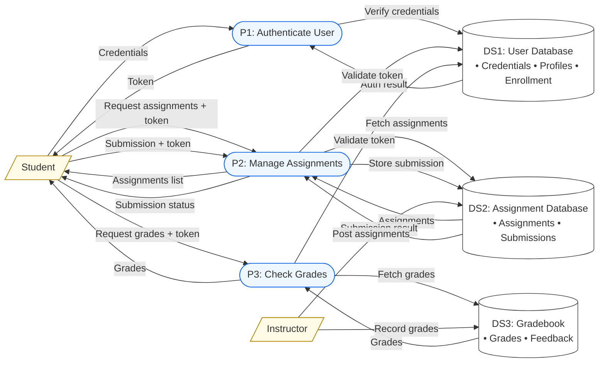

# Canvas-Like Student Data Flow Diagram

```mermaid
flowchart LR
  classDef store fill:#fff,stroke:#444,stroke-width:1px;
  classDef proc fill:#eef7ff,stroke:#1f6feb,stroke-width:1.2px,rx:8,ry:8;
  classDef ext fill:#fffbe6,stroke:#b38600,stroke-width:1.2px,rx:6,ry:6;

  %% External Entities
  Student[/"Student"/]:::ext
  Instructor[/"Instructor"/]:::ext

  %% Processes
  P1([P1: Authenticate User]):::proc
  P2([P2: Manage Assignments]):::proc
  P3([P3: Check Grades]):::proc

  %% Data Stores
  DS1[(DS1: User Database<br/>• Credentials • Profiles • Enrollment)]:::store
  DS2[(DS2: Assignment Database<br/>• Assignments • Submissions)]:::store
  DS3[(DS3: Gradebook<br/>• Grades • Feedback)]:::store

  %% --- P1: Authenticate User ---
  Student -->|"Credentials"| P1
  P1 -->|"Verify credentials"| DS1
  DS1 -->|"Auth result"| P1
  P1 -->|"Token"| Student

  %% --- P2: Manage Assignments ---
  Student -->|"Request assignments + token"| P2
  P2 -->|"Validate token"| DS1
  P2 -->|"Fetch assignments"| DS2
  DS2 -->|"Assignments"| P2
  P2 -->|"Assignments list"| Student
  Student -->|"Submission + token"| P2
  P2 -->|"Store submission"| DS2
  DS2 -->|"Submission result"| P2
  P2 -->|"Submission status"| Student

  %% --- P3: Check Grades ---
  Student -->|"Request grades + token"| P3
  P3 -->|"Validate token"| DS1
  P3 -->|"Fetch grades"| DS3
  DS3 -->|"Grades"| P3
  P3 -->|"Grades"| Student

  %% Instructor Interactions ---
  Instructor -->|"Post assignments"| DS2
  Instructor -->|"Record grades"| DS3
```

